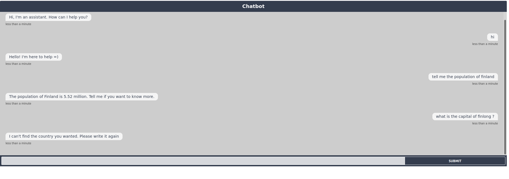

# Chatbot

Simple chatbot using rasa.

## Contents:

- [Function](#function)
- [Integration](#integration)
- [Running Local](#running-local)
- [Updates](#updates)


### Function

Chatbot to find out the population or capital of a specific country. 

Sub functions:
- Greet.
- Goodbye.
- Answer questions about capitals of the world.
- Answer questions about population of countries of the world.


### Integration

To integrate chatbot on different platforms like: slack, whatsapp, facebook. Please change credentials.yml with the right channels and credentials. 

**note:** make sure that actions server is running.

```bash
python -m rasa_sdk.endpoint --actions actions
```
To run on website using rest, you don't need any credentials. Just host and enable rasa API.

```bash
# Make sure actions server is running.
python -m rasa_sdk.endpoint --actions actions

# This is the Rasa backend.
rasa run --enable-api --cors="*"
```
In file "index.html" there's simple connection using [chatroom.js](https://github.com/scalableminds/chatroom) with Rasa. \
To run on different hosts:

- change the host in "index.html" file
- run actions server.
- enable rasa API and make sure the server is up and running.
- Open "index.html"

Example:



### Running Local

- Clone repo.
- Create venv (Recommended).
- install requirments. 
```bash
pip3 install -r requirments.txt
```
- Run actions server.
```bash
python -m rasa_sdk.endpoint --actions actions
```
- Run rasa shell or interactive for further investigation. 

### Updates Needed

Further improvments:

- Converting population API response (lahks and crores) to millions.
- More stories.
- entities coming alone.


